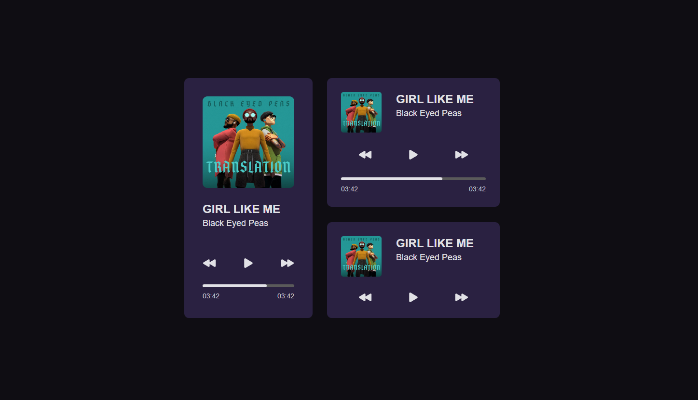

@@ -0,0 +1,52 @@
# Clone Audio Player
#### Project: Update studies with React, Typescript. Creating an audio player based on [Rockeseat](https://www.figma.com/community/file/1195050524500542670).
##### Spotify API search and music change functionality, increasing music play functionality. 

Developed by [Tiago de Freitas Pinheiro](https://github.com/Tiago1106)

## 🖥️ Preview:



To view without downloading and running the repository, [click here](https://cloneaudioplay.netlify.app/)
To create the project I used [React](https://create-react-app.dev/docs/adding-typescript/), for practicality. So I did all the styling with [Styled Components](https://styled-components.com/).

## 📋 Features:

- In development, coming soon.
    - [ ] Play Music

## 📌 Requirements:

Before you begin, check that you have met the following requirements:
* [Visual Studio Code](https://code.visualstudio.com/) or a similar code editor installed;
* [Git](https://git-scm.com) installed;
* [Node 16.13.2](https://nodejs.org/en/download/) or higher installed;
* [Yarn](https://yarnpkg.com/) or [NPM](https://nodejs.org/en/download/) installed;
* [Site](https://cloneaudioplay.netlify.app/)

## 🚀 Installation/Run:

To install the necessary dependencies and run the project in the emulator, just run:

```bash
# Clone the repository
$ git clone https://github.com/Tiago1106/CloneAudioPlayer.git

# Install the dependencies
$ yarn install or npm install

# Execute the project
$ yarn start
```

## 📚 Additional documentations:

- [Styled Components](https://styled-components.com/)
- [React](https://pt-br.reactjs.org/)
- [Typescript](https://www.typescriptlang.org/)
- [APISpotify](https://rapidapi.com/420vijay47/api/spotify117/)
